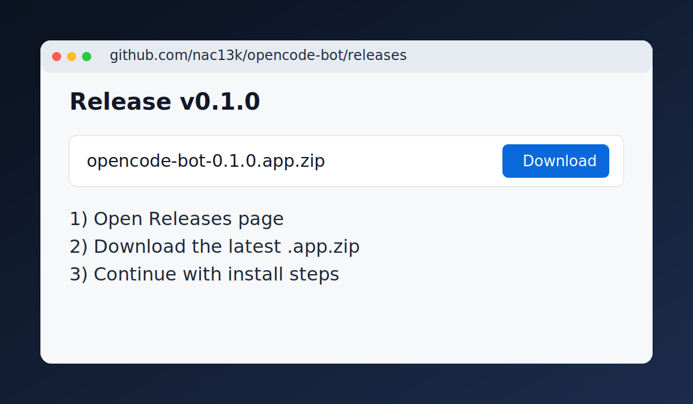
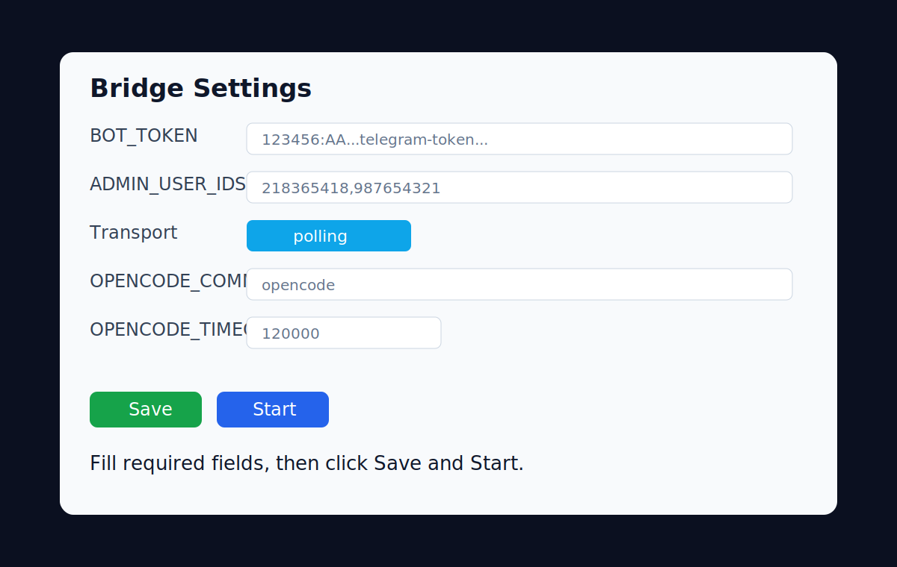

# OpenCode Telegram Bridge (MVP)

Telegram bot that gates access by `telegramUserId`, forwards prompts to OpenCode, and relays final answers through a global OpenCode plugin.

## Installation

1. Install dependencies:

```bash
npm install
```

2. Run typecheck/build once:

```bash
npm run typecheck
npm run build
```

## Configuration

Choose one setup mode.

### Option A: CLI installer (recommended)

```bash
npm run setup
```

The installer validates Telegram/OpenCode access and writes:

- `.env` in project root
- JSON data files under `DATA_DIR` (default `./data`)
- global plugin files in `~/.config/opencode/plugin/telegram-relay/`

### Option B: Manual `.env`

Create `.env` with:

```env
BOT_TOKEN=<telegram-bot-token>
ADMIN_USER_IDS=<comma-separated-user-ids>
BOT_TRANSPORT=polling
DATA_DIR=./data
OPENCODE_COMMAND=opencode
OPENCODE_TIMEOUT_MS=120000
```

## Run

Start the bot:

```bash
npm run dev
```

Or production mode:

```bash
npm run build
npm start
```

## Admin Commands

- `/allow <userId>`
- `/deny <userId>`
- `/list`
- `/status`
- `/resolve @username` (best-effort helper only)

## Session Selector

- `/session` show current linked OpenCode session
- `/session list` list recent OpenCode sessions with interactive buttons
- `/session use <ses_...>` switch current chat/user to an existing session
- `/session new` clear session link and force a new one on next message
- `/sessions` alias to list recent sessions with interactive buttons

## Notes

- Auth is strictly by numeric `telegramUserId`.
- Username resolution is convenience-only and never used as auth source.
- Installer writes plugin files to `~/.config/opencode/plugin/telegram-relay/`.

## macOS Tray App

This repository includes a macOS menu bar app at `macos/TrayBridgeApp`.

- Menu bar icon shows running/stopped status.
- Menu supports Start, Stop, Restart, and opening settings.
- Settings window manages `BOT_TOKEN`, `ADMIN_USER_IDS`, transport, OpenCode settings, and logs.
- Settings are stored in a local SQLite database inside the app support directory.
- Release builds bundle the server payload (and Node runtime) inside the app for easier install.
- App runs only with bundled server payload (no external project-path fallback).
- Build process generates a custom app icon and embeds app description metadata.

Run locally:

```bash
cd macos/TrayBridgeApp
swift run TrayBridgeApp
```

Build a double-clickable `.app` bundle:

```bash
./macos/TrayBridgeApp/scripts/build-app.sh
open ./macos/TrayBridgeApp/dist/TrayBridgeApp.app
```

### Download and install from GitHub Releases

1. Open Releases page:

```text
https://github.com/nac13k/opencode-bot/releases
```



2. Download the latest file:

- `TrayBridgeApp-<version>.dmg` (recommended, self-contained)
- `TrayBridgeApp-<version>.app.zip`

3. Unzip and move `TrayBridgeApp.app` to `Applications`.


4. First launch:

```bash
xattr -dr com.apple.quarantine /Applications/TrayBridgeApp.app
open /Applications/TrayBridgeApp.app
```

5. In app settings, configure:

- `BOT_TOKEN`
- `ADMIN_USER_IDS`
- optional OpenCode fields (`OPENCODE_COMMAND`, timeout, transport)

The app persists this configuration in SQLite and launches the bundled bridge service.



### macOS signing and startup errors

If macOS blocks startup because of signature/trust:

```bash
xattr -dr com.apple.quarantine ./macos/TrayBridgeApp/dist/TrayBridgeApp.app
codesign --force --deep --sign - ./macos/TrayBridgeApp/dist/TrayBridgeApp.app
open ./macos/TrayBridgeApp/dist/TrayBridgeApp.app
```

For distribution with a real Apple certificate:

```bash
APPLE_SIGN_IDENTITY="Developer ID Application: Your Name (TEAMID)" ./macos/TrayBridgeApp/scripts/build-app.sh
```

## CI/CD on `main`

This project includes a GitHub Actions workflow at `.github/workflows/build-and-release.yml`.

- Trigger: every push to `main`.
- Security: runs `gitleaks` secret scan before build/release steps.
- Build steps: `npm ci`, `npm run typecheck`, `npm run build`, and macOS tray app packaging.
- Version source: `package.json` field `version`.
- Tag: `v${version}` is created if it does not exist.
- Publish: a GitHub Release is created/updated with build artifacts.

If you want a new tag/release version, update `version` in `package.json`.
